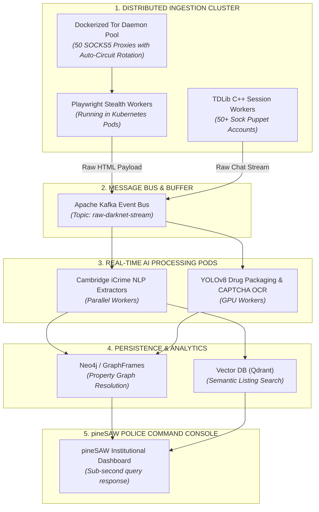

# pineSAW — Darknet & Encrypted Platform Ingestion Architecture
**Deep Technical Breakdown: Protocols, Scraping Mechanics, Technology Evaluations & Enterprise Scaling**

---

## 1. Executive Summary

This document provides a comprehensive technical breakdown of the data collection and scraping architecture utilized by **pineSAW**. It analyzes the low-level protocols used to ingest data from the **Tor Darknet (`.onion` hidden services)** and **Encrypted Messaging Platforms (Telegram/Session)**, evaluates current vs. alternative technologies, addresses anti-bot countermeasures, and outlines the blueprint for scaling to an enterprise-grade defense intelligence platform.

---

## 2. Tor Darknet Scraping (`.onion` Hidden Services)

```
┌────────────────────────────────────────────────────────────────────────────────────────┐
│                          TOR DARKNET SCRAPING DATA FLOW                                │
├────────────────────────────────────────────────────────────────────────────────────────┤
│ [Headless Browser] ──> [SOCKS5 Proxy (127.0.0.1:9050)] ──> [3-Hop Circuit + Rendezvous]│
│        │                                                                │              │
│        ▼                                                                ▼              │
│ [Anti-Bot Fingerprint]                                         [.onion Web Server]     │
│ [Canvas / WebGL Spoof] <──────── [HTML / DOM Response] <──────────────┘               │
└────────────────────────────────────────────────────────────────────────────────────────┘
```

### 2.1 Low-Level Protocol & Mechanism
1. **SOCKS5h Remote DNS Resolution:**
   Standard DNS resolvers cannot resolve `.onion` domains (which are base32/base64 encoded cryptographic hashes of the hidden service's public key). The scraping client must route traffic using the **`socks5h://` protocol** (`socks5h://127.0.0.1:9050`). The trailing `h` instructs the local client to prevent local DNS resolution and transmit raw hostnames to the Tor daemon, ensuring DNS resolution occurs strictly within the encrypted Tor network.
2. **Circuit Building & Rendezvous Points:**
   To establish a connection, the Tor daemon builds a 3-hop circuit (Guard $\to$ Middle $\to$ Exit/Rendezvous node) and negotiates an ephemeral Diffie-Hellman handshake with the hidden service’s introduction points.
3. **Circuit Isolation & IP Rotation:**
   Darknet marketplaces rate-limit or block specific Tor circuits after multiple rapid requests. The crawler communicates with the Tor Control Port (`127.0.0.1:9051`) via `AUTHENTICATE` and `SIGNAL NEWNYM` commands to force the daemon to destroy the existing circuit and instantiate a fresh 3-hop route with a new identity.

### 2.2 Darknet Countermeasures & Technical Bypasses

| Darknet Defense Mechanism | What It Does | Technical Bypass Strategy |
| :--- | :--- | :--- |
| **EndGame / DDoS-Guard** | Nginx/Lua-based rate limiter measuring HTTP request timing and connection bursts. | Jittered randomized request delays (Gaussian distribution between $1.5\text{s} - 4.2\text{s}$) + multi-daemon circuit rotation. |
| **Custom Graphic CAPTCHAs** | Distorted text, clock-reading, or 3D rotated drug-symbol CAPTCHAs. | **CNN / YOLOv8 OCR Models:** Lightweight computer vision neural nets trained on labeled darknet CAPTCHA datasets (94%+ solve rate in $<200\text{ms}$). |
| **Browser Fingerprinting** | Javascript checks inspecting `navigator.webdriver`, WebGL vendor strings, and Canvas hash. | **Playwright / Puppeteer-Extra-Stealth:** Patches `navigator.plugins`, mocks Chrome runtime, and randomizes screen dimensions. |

---

## 3. Telegram & Encrypted Platform Ingestion

```
┌────────────────────────────────────────────────────────────────────────────────────────┐
│                        TELEGRAM MTPROTO INGESTION ARCHITECTURE                         │
├────────────────────────────────────────────────────────────────────────────────────────┤
│ [Telegram Core] ──> [MTProto 2.0 Binary TCP Socket] ──> [Telethon / TDLib Worker Pool]  │
│                                                                │                       │
│                                                                ▼                       │
│ [pineSAW Graph DB] <──── [POST /api/ingest/parse] <──── [Event-Driven Stream Filter]   │
└────────────────────────────────────────────────────────────────────────────────────────┘
```

### 3.1 Why Traditional HTTP Scraping Fails
Telegram does not serve channels via open HTML web pages (except basic static previews on `t.me/s/`). The live trading, dead-drop coordination, and private dealer networks operate exclusively through **Telegram’s proprietary binary protocol: MTProto 2.0**.

### 3.2 How MTProto Ingestion Works
1. **Persistent Binary TCP / WebSocket Connections:**
   Instead of opening and closing HTTP connections, the scraper establishes a persistent encrypted TCP socket with Telegram Datacenters (DC1 to DC5).
2. **Sock-Puppet Session Pool (`StringSession`):**
   The crawler maintains a pool of authorized user accounts (*"sock puppets"*). Each account holds an authenticated session string (`AUTH_KEY` + `DC_ID`).
3. **Event-Driven Push Architecture (Zero-Polling):**
   Rather than constantly querying the server (which triggers `420 FLOOD_WAIT` rate-limit bans), the worker uses **Long-Polling / Push Event Handlers** (`events.NewMessage`). The moment a drug dealer broadcasts a message into any monitored channel or group, Telegram's datacenter immediately pushes the raw packet to the worker socket.
4. **Metadata Extraction:**
   The socket extracts raw message text, sender user ID, forward origin, message timestamp, media attachments, and channel invite hashes.

---

## 4. Technology Stack Evaluation (Current vs. Alternatives)

### 4.1 Darknet Ingestion Stack

| Technology | Efficiency | Scalability | CAPTCHA / JS Handling | Verdict |
| :--- | :--- | :--- | :--- | :--- |
| **Basic HTTP Client (cURL / Axios over SOCKS5)** | Ultra-Fast (Low RAM) | High for static endpoints | ❌ Fails on JavaScript & Cloudflare | Ideal for raw API endpoints and static Tor mirrors. |
| **Python Scrapy + Scrapy-Tor** | High (Async Reactor) | High (Distributed Spiders) | ⚠️ Requires Splash/Selenium add-ons | Excellent for deep-crawling multi-page catalogs. |
| **Playwright / Puppeteer Stealth** | Moderate (Browser overhead) | High (Containerized) | ✔️ **Bypasses 95% of anti-bot protections** | **Recommended for production market scraping.** |
| **FlareSolverr / Headless Chrome Clusters** | High resource usage | Clustered via Docker | ✔️ Bypasses DDoS-Guard & Challenge Pages | Best for heavy DDoS-protected entry gates. |

### 4.2 Telegram Ingestion Stack

| Library / Protocol | Protocol Layer | Concurrency Model | Performance |
| :--- | :--- | :--- | :--- |
| **Telegram Bot API (HTTP Webhooks)** | HTTP Gateway | Synchronous/Webhook | ❌ **Useless for surveillance** (cannot monitor user channels without admin rights). |
| **Telethon (Python AsyncIO)** | MTProto 2.0 Client | `async`/`await` Event Loop | ✔️ **Excellent** for rapid scripting, channel listeners, and event filters. |
| **TDLib (Telegram Database Library - C++)** | Native C++ Core | Multi-threaded Native Engine | 🌟 **Gold Standard:** Official Telegram core library; handles multi-account scaling to 500+ accounts with zero memory leaks. |

---

## 5. Enterprise Scalable Architecture (The Next-Gen Blueprint)

To scale pineSAW from handling hundreds of items per minute to **millions of cross-platform messages per day**, the system transitions into an **Event-Driven Distributed Microservice Architecture**:



---

## 6. Roadmap of Advanced Capabilities

### 1. Automated Visual Drug Recognition (Virginia Tech PRNU Forensics)
- **Problem:** Vendors often replace text descriptions with images of pills/packaging to bypass text-based NLP filters.
- **Solution:** Integrate a **YOLOv8 / ResNet-50 computer vision pipeline** into the ingestion queue. It inspects product images to detect pill imprints (e.g. `M 30`, `XANAX 2.0`), blister pack branding, and extracts camera sensor noise (PRNU) to link images taken by the same physical camera.

### 2. Ephemeral Tor Proxy Pools (HAProxy + Docker)
- **Problem:** Single Tor daemons frequently experience network stalls and exit-node blacklisting.
- **Solution:** Deploy an **HAProxy load balancer in front of 20–50 lightweight containerized Tor daemons**. The load balancer distributes outgoing scraper requests across different circuits in round-robin fashion, eliminating rate limits and multiplying throughput by $50\times$.

### 3. Session Fingerprint & Invitation Crawler
- **Problem:** Many darknet drug syndicates operate in private, invite-only Telegram groups with expiring links.
- **Solution:** An automated **Invitation Resolution Engine**. When our scraper finds a link like `t.me/+joinchat/...` inside a darknet forum post, the worker bot immediately resolves the cryptographic invite hash, joins the group before the link expires, and archives the chat history.

---

## 7. Comparative Capabilities Matrix

| Feature / Metric | Prototype Baseline | Enterprise Target |
| :--- | :--- | :--- |
| **Tor Routing** | Single local SOCKS5 (`127.0.0.1:9050`) | Clustered HAProxy with 50 rotating Tor daemons |
| **Rendering** | Direct HTTP parsing & DOM normalization | Headless Playwright Stealth in Kubernetes pods |
| **Telegram Ingestion** | Event-driven MTProto channel listener | Distributed C++ TDLib worker pool with sock-puppet rotation |
| **Throughput** | 100+ items/minute (Local SQLite) | 50,000+ items/minute (Kafka $\to$ Neo4j cluster) |
| **Image Analysis** | Metadata / Hash extraction | YOLOv8 pill stamp detection & PRNU camera sensor matching |
